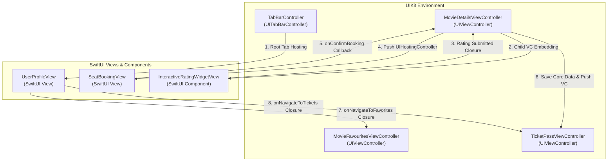
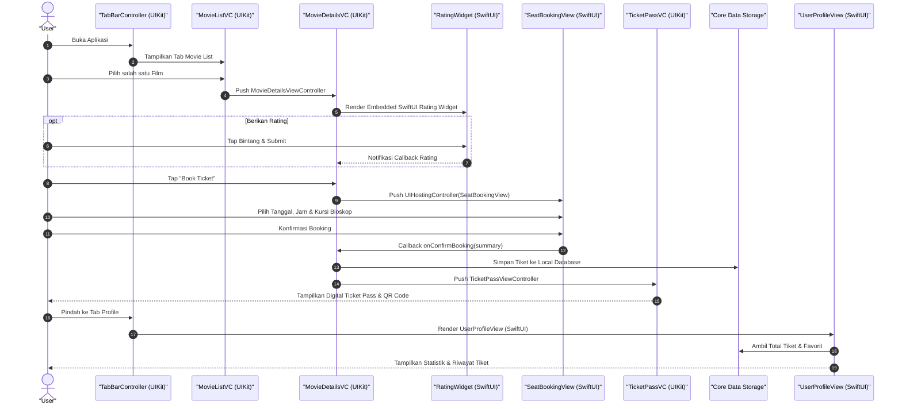

# RateMovie 🎬🍿

[](https://developer.apple.com/ios/)
[](https://swift.org)
[](https://en.wikipedia.org/wiki/Model%E2%80%93view%E2%80%93viewmodel)
[](#-arsitektur-monolith-with-clean-architecture)
[](https://developer.apple.com/xcode/swiftui/)
[](https://cocoapods.org)

**RateMovie** adalah aplikasi iOS modern untuk eksplorasi film, ulasan interaktif, dan simulasi pemesanan tiket bioskop (*Seat Booking & Digital Ticket Pass*). 

Proyek ini dibangun dengan struktur **Monolith yang telah menerapkan Clean Architecture + MVVM** secara disiplin. Meskipun berada dalam satu basis kode (*monolithic target*), seluruh lapisan aplikasi terpisah secara *decoupled* (Presentation, Domain, Data) dengan pemisahan komponen UI lokal (`RMComponents`), sehingga arsitektur tetap bersih, mudah diuji (*highly testable*), dan siap dimigrasikan ke *Multi-module / Micro-features* di masa mendatang.

Aplikasi ini juga dirancang sebagai ajang eksplorasi mendalam untuk menghubungkan **UIKit ke SwiftUI** dan **SwiftUI ke UIKit** secara *two-way*, termasuk menempelkan komponen SwiftUI ke dalam layar UIKit.

---

## 📑 Table of Contents
- [Overview](#-overview)
- [Sorotan Utama: UIKit & SwiftUI Hybrid Interoperability](#-sorotan-utama-uikit--swiftui-hybrid-interoperability)
- [Key Features](#-key-features)
- [Arsitektur: Monolith with Clean Architecture](#-arsitektur-monolith-with-clean-architecture)
- [Application Flow](#-application-flow)
- [Tech Stack](#-tech-stack)
- [Requirement](#-requirement)
- [Installation & Getting Started](#-installation--getting-started)
- [Author & Maintainer](#-authormaintainer)

---

## 🌟 Overview

RateMovie menyajikan pengalaman pengguna yang kaya (*rich & dynamic*) bagi para pecinta film (*cinephiles*). Pengguna dapat melihat daftar film yang sedang tayang (*Now Playing*), membaca sinopsis dan detail lengkap film dengan animasi *parallax header*, memberikan *rating & review* interaktif secara *real-time*, memilih jadwal dan kursi bioskop secara visual, hingga mencetak tiket digital (*Ticket Pass*) dengan QR Code unik yang tersimpan secara lokal.

### 💡 Fokus Eksperimen & Pembelajaran:
1. **Clean Monolith Architecture**: Mengembangkan aplikasi monolit dengan batasan layer yang tegas (*strict separation of concerns*) antara Domain, Data, dan Presentation.
2. **Two-way Bridging UIKit & SwiftUI**: Transisi antar layar yang mulus (*navigation push/pop*) dari UIKit ke SwiftUI dan sebaliknya.
3. **SwiftUI Component Embedding**: Menanamkan (*embedding*) komponen SwiftUI interaktif langsung di dalam hierarki `UIStackView` milik `UIViewController` UIKit.
4. **SwiftUI View dalam UITabBarController**: Menjadikan SwiftUI View sebagai salah satu root tab item di dalam native `UITabBarController`.
5. **Decoupled Business Logic**: Menjaga business logic di Use Case murni independen dari framework UI (`UIKit`/`SwiftUI`).

---

## 🔄 Sorotan Utama: UIKit & SwiftUI Hybrid Interoperability

Salah satu pilar utama RateMovie adalah implementasi **Two-Way Interoperability** antara **UIKit** dan **SwiftUI**. Seluruh arsitektur dibangun agar komponen modern deklaratif SwiftUI dapat hidup berdampingan secara harmonis dengan komponen imperatif UIKit tanpa merusak *unidirectional data flow*.



### 📊 Matriks Partisipan Komunikasi (Who & How)

| Komponen Asal (*Source*) | Komponen Tujuan (*Target*) | Arah | Mekanisme Komunikasi | Data / Event yang Dikirim |
|---|---|:---:|---|---|
| **`TabBarController`** *(UIKit)* | **`UserProfileView`** *(SwiftUI)* | `UIKit ➡️ SwiftUI` | `UIHostingController` sebagai tab root controller | Inisialisasi ViewModel, DI `MovieFavoritesUseCase` & `TicketPersistenceManager` |
| **`MovieDetailsViewController`** *(UIKit)* | **`InteractiveRatingWidgetView`** *(SwiftUI)* | `UIKit ➡️ SwiftUI` | *Child View Controller Containment* ke dalam `UIStackView` | Inisialisasi rating range, `movieTitle`, dan theme |
| **`InteractiveRatingWidgetView`** *(SwiftUI)* | **`MovieDetailsViewController`** *(UIKit)* | `SwiftUI ➡️ UIKit` | Closure Delegate Callback (`onRatingSubmitted`) | Nilai skor rating (Int: 1–5), memicu `TTGSnackbar` di UIKit |
| **`MovieDetailsViewController`** *(UIKit)* | **`SeatBookingView`** *(SwiftUI)* | `UIKit ➡️ SwiftUI` | `UIHostingController` via `navigationController.pushViewController` | `movieId`, `movieTitle`, callback booking handler |
| **`SeatBookingView`** *(SwiftUI)* | **`MovieDetailsViewController`** *(UIKit)* | `SwiftUI ➡️ UIKit` | Closure Delegate Callback (`onConfirmBooking`) | Struct `SeatBookingSummary` (kursi, jadwal, harga, studio) |
| **`MovieDetailsViewController`** *(UIKit)* | **`TicketPassViewController`** *(UIKit)* | `UIKit ➡️ UIKit` | Transisi UIKit standar setelah persistensi Core Data | Objek `SeatBookingSummary` / `TicketModel` tersimpan |
| **`UserProfileView`** *(SwiftUI)* | **`MovieFavouritesViewController`** *(UIKit)* | `SwiftUI ➡️ UIKit` | Closure Handler (`onNavigateToFavorites`) ke UINavigationController | Permintaan navigasi ke daftar favorit |
| **`UserProfileView`** *(SwiftUI)* | **`TicketPassViewController`** *(UIKit)* | `SwiftUI ➡️ UIKit` | Closure Handler (`onNavigateToTickets`) ke UINavigationController | Permintaan navigasi ke riwayat tiket |

---

### 🧩 Rincian Bagaimana UIKit & SwiftUI Berkomunikasi

#### 1. Menyematkan Komponen SwiftUI ke Layar UIKit (*In-Screen Component Embedding*)
* **Partisipan:** `MovieDetailsViewController` (UIKit) ↔ `InteractiveRatingWidgetView` (SwiftUI)
* **Bagaimana:**
  1. UIKit membuat instance `InteractiveRatingWidgetViewModel` dengan callback `onRatingSubmitted`.
  2. UIKit membungkus View SwiftUI ke dalam `UIHostingController(rootView: ...)`.
  3. Menggunakan pola resmi **Child View Controller Containment** (`addChild`, `insertArrangedSubview`, `didMove(toParent:)`) agar lifecycle event (viewWillAppear, layout, traits) diteruskan sempurna.
  4. Ketika user memilih bintang dan menekan *Submit*, SwiftUI memicu closure yang mengeksekusi method native UIKit untuk menampilkan snackbar konfirmasi:

```swift
// Di dalam MovieDetailsViewController.swift (UIKit)
private func setupRatingWidget() {
    let ratingVM = InteractiveRatingWidgetViewModel(
        movieTitle: viewModel?.title,
        onRatingSubmitted: { [weak self] score in
            self?.snakeBarGreen(message: "Terima kasih atas rating Anda (\(score)★)!")
        }
    )
    let hostingController = UIHostingController(rootView: InteractiveRatingWidgetView(viewModel: ratingVM))
    hostingController.view.backgroundColor = .clear

    addChild(hostingController)
    contentStackView.insertArrangedSubview(hostingController.view, at: targetIndex)
    hostingController.didMove(toParent: self)
}
```

#### 2. Navigasi Layar Penuh UIKit ke SwiftUI (*Full-Screen Push Navigation*)
* **Partisipan:** `MovieDetailsViewController` (UIKit) ➡️ `SeatBookingView` (SwiftUI)
* **Bagaimana:**
  1. Pengguna menekan tombol native UIButton *"Book Ticket"* di UIKit.
  2. UIKit menginstansiasi `SeatBookingViewModel` dengan parameter `movieId`, `movieTitle`, serta closure `onConfirmBooking`.
  3. Mengemas `SeatBookingView` ke dalam `UIHostingController` dan melakukan `pushViewController` pada `navigationController`:

```swift
// Di dalam MovieDetailsViewController.swift (UIKit)
@objc func didTapBookTicket() {
    let bookingVM = SeatBookingViewModel(
        movieId: viewModel?.getMovieId(),
        movieTitle: viewModel?.title ?? "Movie Details",
        onConfirmBooking: { [weak self] summary in
            self?.handleBookingConfirmation(summary: summary)
        }
    )
    let bookingView = SeatBookingView(viewModel: bookingVM)
    let hostingController = UIHostingController(rootView: bookingView)
    hostingController.hidesBottomBarWhenPushed = true
    navigationController?.pushViewController(hostingController, animated: true)
}
```

#### 3. Mengirim Data Balik dari SwiftUI & Menyimpan ke Core Data (*Data Handover & Persistence*)
* **Partisipan:** `SeatBookingView` (SwiftUI) ➡️ `MovieDetailsViewController` (UIKit) ➡️ `TicketPassViewController` (UIKit)
* **Bagaimana:**
  1. Setelah user memilih kursi di SwiftUI, tombol checkout memicu closure `onConfirmBooking(summary)`.
  2. Kontrol kembali ke UIKit `MovieDetailsViewController.handleBookingConfirmation(summary:)`.
  3. UIKit menyimpan data tiket ke **Core Data** via `TicketPersistenceManager.shared`.
  4. Setelah penyimpanan sukses, UIKit melakukan `pushViewController` ke `TicketPassViewController` untuk menampilkan QR Code dan rincian pass tiket bioskop.

```swift
// Di dalam MovieDetailsViewController.swift (UIKit)
public func handleBookingConfirmation(summary: SeatBookingSummary) {
    let ticketModel = summary.toTicketModel()
    ticketPersistenceManager.saveTicket(ticketModel) { [weak self] result in
        guard let self = self else { return }
        let ticketPassVC = TicketPassViewController(summary: summary, onDone: { [weak self] in
            self?.navigationController?.popToViewController(self!, animated: true)
        })
        self.navigationController?.pushViewController(ticketPassVC, animated: true)
    }
}
```

#### 4. Navigasi SwiftUI ke Layar UIKit (*SwiftUI to UIKit Deep Navigation*)
* **Partisipan:** `UserProfileView` (SwiftUI) ➡️ `MovieFavouritesViewController` (UIKit)
* **Bagaimana:**
  1. Di dalam `TabBarController` (UIKit), `UserProfileView` diinisialisasi dan di-wrap ke dalam `UIHostingController`.
  2. `TabBarController` mengikat *callback closure* (`onNavigateToFavorites`) ke ViewModel SwiftUI.
  3. Saat user menekan tombol menu di SwiftUI, closure dipanggil dan `UINavigationController` UIKit melakukan *push* layar `MovieFavouritesViewController` yang murni berbasis UIKit:

```swift
// Di dalam TabBarController.swift (UIKit)
func createUserProfileTab(profileViewModel: UserProfileViewModel = UserProfileViewModel()) -> UIViewController {
    let userProfileView = UserProfileView(viewModel: profileViewModel)
    let profileHostingController = UIHostingController(rootView: userProfileView)
    
    profileViewModel.onNavigateToFavorites = { [weak self, weak profileHostingController] in
        guard let self = self else { return }
        let movieFavouritesController = self.createMovieFavouritesViewController()
        profileHostingController?.navigationController?.pushViewController(movieFavouritesController, animated: true)
    }
    
    profileHostingController.tabBarItem = UITabBarItem(title: "Profile", image: UIImage(systemName: "person"), tag: 1)
    return profileHostingController
}
```

#### 5. Sinkronisasi Data & Shared State Antar Framework
* **Mekanisme Single Source of Truth:**
  - **Core Data Storage:** Baik layer UIKit (seperti `MovieFavouritesViewController` & `TicketPassViewController`) maupun SwiftUI (seperti `UserProfileView` statistik) mengakses data melalui protokol domain (`MovieFavoritesUseCaseProtocol` & `TicketPersistenceManagerProtocol`).
  - **Reactive State (`ObservableObject` & `@Published`):** Ketika layar SwiftUI aktif (`.onAppear`), ViewModel SwiftUI memanggil data Core Data secara *asynchronous* (menggunakan `DispatchGroup`) dan secara otomatis memperbarui UI SwiftUI secara reaktif.

---

## 🚀 Key Features

* **🎬 Movie Catalog & Discovery:** Menampilkan daftar film terbaru dengan integrasi REST API, poster beresolusi tinggi, dan kategori genre.
* **✨ Dynamic Parallax Movie Details:** Halaman detail film dengan efek *stretchy backdrop image*, *fade-in navigation bar*, rating bintang, genre badges, dan daftar *similar movies*.
* **⭐ Interactive SwiftUI Star Rating Widget:** Komponen ulasan interaktif dengan animasi bintang spring, badge skor dinamis, dan feedback submit.
* **💺 Visual Seat Booking System:** Simulasi pemilihan tanggal penayangan, slot jam tayang, dan grid denah kursi bioskop interaktif (*Available, Selected, Reserved*) menggunakan SwiftUI state management.
* **🎫 Digital Cinema Ticket Pass:** Tiket bioskop digital bergaya *boarding pass* dengan nomor kursi, studio hall, rincian harga, dan QR Code unik yang disimpan ke **Core Data**.
* **❤️ Offline Favorites Management:** Menyimpan dan mengelola film favorit ke dalam local database Core Data dengan indikator status instan.
* **👤 Cinephile User Profile Dashboard:** Dashboard aktivitas pengguna (total jam nonton, jumlah ulasan, tiket aktif, dan status membership VIP).

---

## 🏛️ Arsitektur: Monolith with Clean Architecture

Aplikasi ini saat ini berjalan sebagai **Monolithic Application**, namun telah menerapkan prinsip **Clean Architecture + MVVM** secara terstruktur:

> [!NOTE]
> **Mengapa Monolith dengan Clean Architecture?**
> - **Sederhana & Efisien:** Seluruh kode berada dalam satu target utama tanpa overhead konfigurasi multi-target yang kompleks, cocok untuk kecepatan iterasi dan eksplorasi *bridging* UI.
> - **Strict Layer Separation:** Meskipun monolit, arsitektur tidak berbentuk *spaghetti code*. Hubungan antar layer dikunci menggunakan protokol (*Dependency Inversion Principle*).
> - **Modular-Ready:** Pemisahan folder dan dependensi sudah terisolasi dengan rapi (`Presentation`, `Domain`, `Data`, serta modul lokal `RMComponents`), sehingga siap jika suatu saat ingin diekstrak menjadi *Modular Framework / Swift Package (SPM)*.

### Struktur Hierarki Folder:

```
RateMovie/
├── Presentation/               # Presentation Layer (UI & ViewModel)
│   ├── BaseScene/              # TabBarController, Root Navigation
│   └── MovieScene/
│       ├── MovieList/          # UIKit Movie Browsing Screen
│       ├── MovieDetails/       # UIKit Movie Detail + Embedded SwiftUI Rating
│       ├── MovieFavourites/    # UIKit Favorite Movies Screen
│       ├── SeatBooking/        # SwiftUI Visual Seat Booking Screen
│       ├── TicketPass/         # UIKit Digital Cinema Pass Screen
│       └── UserProfile/        # SwiftUI Cinephile Dashboard Screen
│
├── Domain/                     # Domain Layer (Pure Business Logic)
│   ├── Entities/               # Pure Swift Models (FavoriteNowPlaying, Movie, etc.)
│   └── UseCase/                # Use Cases (FetchMovieUseCase, MovieFavoritesUseCase, etc.)
│
├── Data/                       # Data Layer (Repositories & Data Sources)
│   ├── PersistenceStorage/     # Core Data Model (RateMovie.xcdatamodeld)
│   └── Repositories/           # BaseMovieRepository, TicketPersistenceManager
│
├── RMComponent/ & RMPods/      # Modular Reusable UI Components & Frameworks
└── Utilities+ExtendKit/        # Design System (RMColor, RMFont), Extensions & Helpers
```

### Keunggulan Arsitektur:
- **Separation of Concerns:** Business logic murni berada di *Domain Layer* tanpa ketergantungan pada UI Framework (`UIKit`/`SwiftUI`).
- **Data Persistence Abstraction:** Manajemen Core Data dibungkus dalam protokol repository (`TicketPersistenceManagerProtocol`, `BaseMovieRepositoryProtocol`) sehingga mudah di-*mock* saat unit testing.
- **Unified Design System:** Warna (`RMColor`) dan tipografi (`RMFont`) dapat digunakan secara konsisten baik di elemen UIKit (`UIColor`/`UIFont`) maupun SwiftUI (`Color`/`Font`).

---

## 📱 Application Flow



---

## 🛠️ Tech Stack

### Core & Frameworks
* **Language:** Swift 5+
* **UI Frameworks:** UIKit (AutoLayout, Storyboard/XIB, Programmatic UI) & SwiftUI
* **Database / Persistence:** Core Data (`RateMovie.xcdatamodeld`)
* **Concurrency & Binding:** GCD, Closure Callbacks, Combine / Observable Pattern (`@ObservedObject`, `@Published`)
* **Unit Testing:** XCTest (Coverage untuk ViewModels, Use Cases, Formatting, & Interop Logic)

### Third-Party Libraries (via CocoaPods)
| Library | Deskripsi / Fungsi |
|---|---|
| **[Alamofire](https://github.com/Alamofire/Alamofire)** | HTTP Networking library untuk konsumsi REST API film |
| **[Kingfisher](https://github.com/onevcat/Kingfisher)** | Asynchronous image downloader & caching untuk poster dan backdrop film |
| **[netfox](https://github.com/kasketis/netfox)** | In-app network HTTP traffic inspector & debugging tool |
| **[IQKeyboardManager](https://github.com/hackiftekhar/IQKeyboardManager)** | Solusi otomatis pencegahan keyboard menutupi text input |
| **[TTGSnackbar](https://github.com/zekunyan/TTGSnackbar)** | Notifikasi toast/snackbar interaktif dan elegan di bagian bawah layar |

---

## 📋 Requirement

Sebelum menjalankan proyek ini, pastikan sistem Anda memenuhi persyaratan berikut:
* **macOS:** macOS Monterey (12.0) atau versi lebih baru
* **Xcode:** Xcode 14.0 atau versi lebih baru
* **iOS Deployment Target:** iOS 13.0+ (Rekomendasi iOS 14.0+ / iOS 15.0+)
* **Dependency Manager:** [CocoaPods](https://cocoapods.org) versi 1.10+
* **Swift Version:** Swift 5.0+

---

## 💻 Installation & Getting Started

Ikuti langkah-langkah berikut untuk meng-clone dan menjalankan proyek di mesin lokal Anda:

1. **Clone Repository:**
   ```bash
   git clone https://github.com/dhikadityre/RateMovie.git
   cd RateMovie
   ```

2. **Install Dependencies:**
   Jalankan CocoaPods untuk mengunduh dan mengonfigurasi pod yang dibutuhkan:
   ```bash
   pod install
   ```

3. **Buka Workspace di Xcode:**
   Buka file `.xcworkspace` (bukan `.xcodeproj`):
   ```bash
   open RateMovie.xcworkspace
   ```

4. **Jalankan Aplikasi:**
   - Pilih target skema `RateMovie`.
   - Pilih simulator (misal: *iPhone 14 Pro / iPhone 15 Pro*) atau perangkat fisik iOS.
   - Tekan `Cmd + R` untuk melakukan *Build & Run*.

5. **Menjalankan Unit Test:**
   - Tekan `Cmd + U` di Xcode untuk menjalankan seluruh test suite pada `RateMovieTests`.

---

## 👨‍💻 Author/Maintainer

**DHIKA ADITYA ARE**
* **Repository:** [RateMovie on GitHub](https://github.com/dhikadityre/RateMovie)
* **Role:** iOS Developer / Maintainer
* **Focus:** iOS Architecture, UIKit & SwiftUI Hybrid System, Clean Code & Modular Design

---
*Dikembangkan dengan ❤️ dan dedikasi untuk eksplorasi arsitektur iOS modern.*
